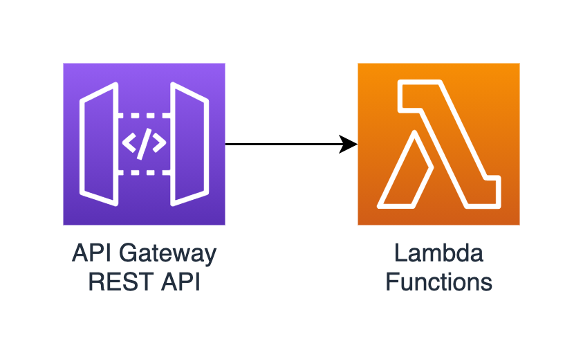

# AWS REST API + Lambda

This Terraform module deploys a REST API to AWS API Gateway. It also deploys one or more Lambda functions that you provide and integrates them with the API.



* The API invoke URL will be output.
* The API is regional.
* All Lambda integrations are proxy integrations.
* The API is auto-deployed to a stage.
* No CORS. No request/response modeling/customization.
* Lambda functions should be pre-built and packaged into ZIPs.
* Defaults are used for Lambda memory and timeouts.
* For each Lambda function, the following is created:
  * Permission to allow API Gateway to invoke it.
  * CloudWatch log group and appropriate execution role.

Example: Provide inputs to this module as follows:

```lang-hcl
api_endpoints = {
    "/" = { get = "lambda1" }
    "/pets" = {
        get = "lambda2"
        post = "lambda1"
    }
    "/pets/{petID}" = { get = "lambda3" }
    "/toys" = { get = "lambda3" }
}

lambda_functions = {
    lambda1 = {
        runtime = "nodejs14.x"
        handler = "index.handler"
        zip = "../lambda1.zip"
    }
    lambda2 = {
        runtime = "nodejs14.x"
        handler = "index.handler"
        zip = "../lambda2.zip"
    }
    lambda3 = {
        runtime = "python3.7"
        handler = "index.handler"
        zip = "../lambda3.zip"
    }
}
```
